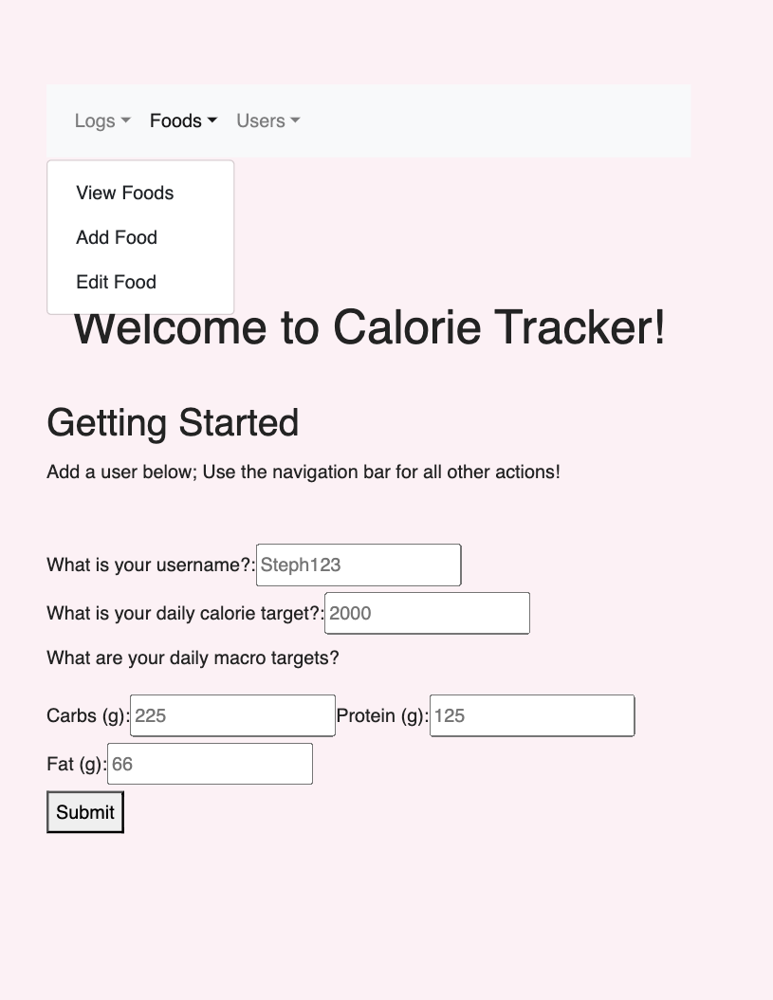
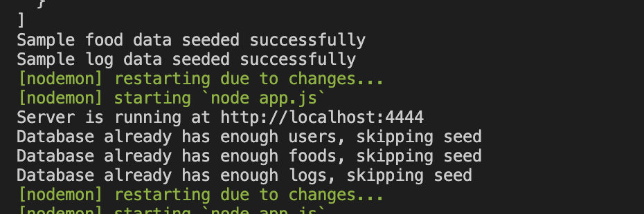
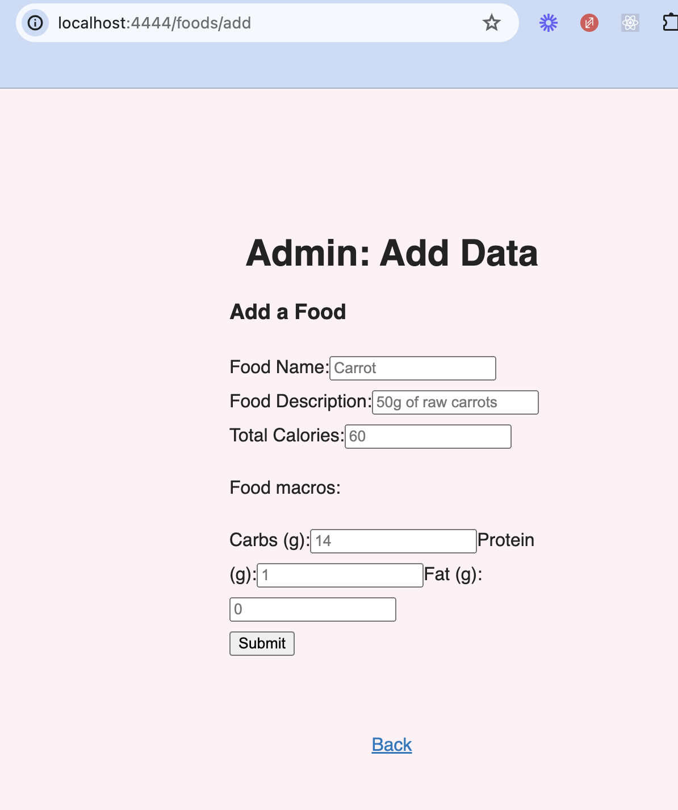
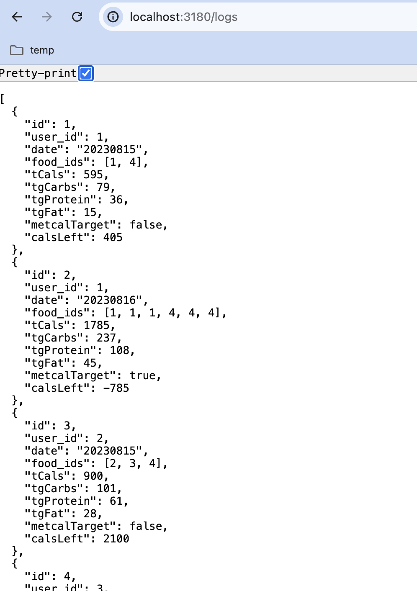
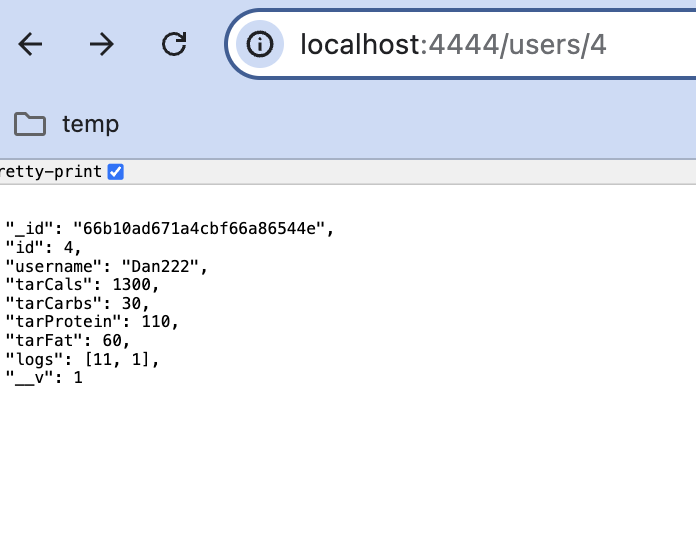
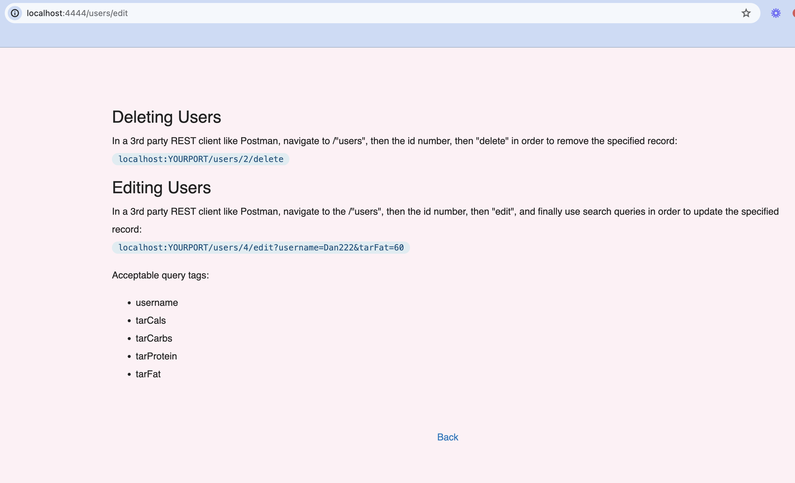
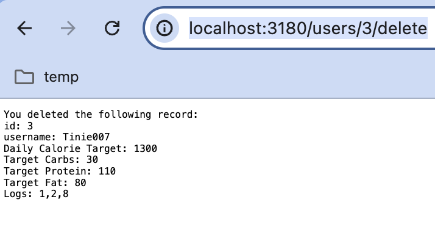
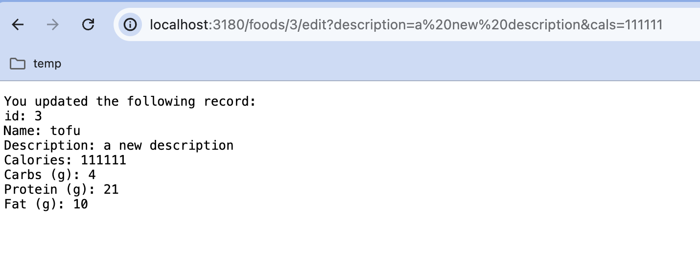

# Calorie Tracker API with Mongoose
This project is a features an API that serves data from a connected cloud-based MongoDB database. I used Express to organize the site, utilizing middleware such as Body Parser, Express Router, and others in order to handle requests from site visitors.

## Table of Contents
- [Installation](#installation)
- [Usage](#usage)
- [Features](#features)
- [Acknowledgements](#acknowledgements)
  
## Installation

##### Clone the repository

git clone https://github.com/steph2017/318_SBA.git

##### Navigate to the project directory
cd your-repo-name

##### Create your own .env file
include a PORT and MONGOURL variable with the appropriate values (PORT should be a number like 3000, MONGOURL should be text starting with "mongodb+srv://" )

##### Run the file
npm start

## Features

- Landing Page and navigation bar powered by Pug template engine and bootstrap:

- Seed data fed to db upon navigating to root and re-seeding if there are too few entries

- CRUD requests executed by either form (POST requests), navigation (GET requests), or 3rd party client API service provider like POSTMAN (PATCH, DELETE)
- Form for POST requests (there are 3, one on the langing page for users, and one on /foods/add and /logs/add for the respective data types)

  
- GET routes for single id and whole database viewing

- PATCH and Delete routes must be completed in REST client tools such as [Postman](https://www.postman.com/product/api-client/) or [Thunder Client (a VSC extension)](https://www.thunderclient.com/). I tested them via URL navigation as GET requests:
  
  
  

 
## Usage
- Review the landing page and edit pages for usage instructions. To Read data, either click on the "View XXXX" link in the navigation bar or navigate to /data/id where "data" is foods, users, or logs and id is a number.

## Acknowledgements
This was made possible by:
- Instruction from [Tishana](https://github.com/tishana) and [Manara](https://github.com/Manara-Ali) under the [Per Scholas Software Engineering Immersive]https://perscholas.org/courses/software-engineer/
- [Pug](https://pugjs.org/api/getting-started.html) for front-end rendering
- [HTML to Pug](https://html-to-pug.com/) for coding help on the navigation bar view template
- [Bootstrap](https://getbootstrap.com/docs/5.3/getting-started/introduction/) for easy formatting
- [Express.js](https://expressjs.com/en/starter/installing.html) for server functionality 
- And troubleshooting resources such as [Stack Overflow](https://stackoverflow.com/).
